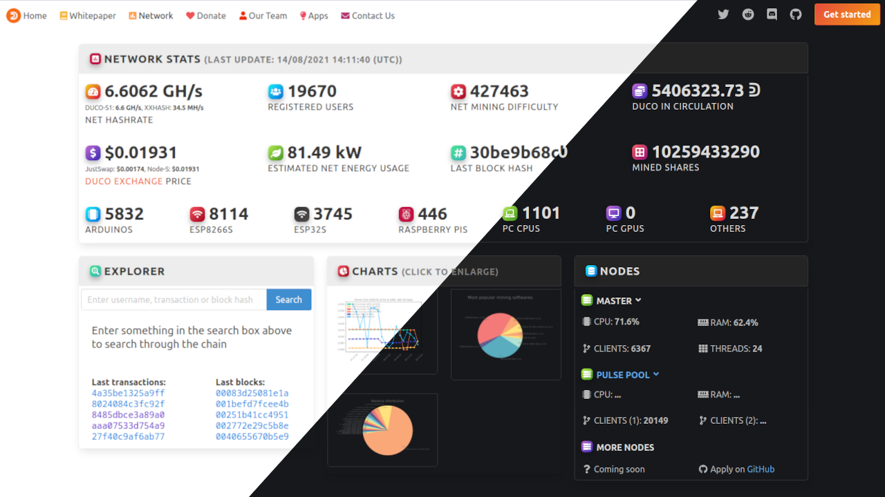

# [Duino-Coin explorer and network statistics website](https://revoxhere.github.io/duco-statistics/statistics)

## Network statistics
Data is gathered from public [Duino-Coin JSON API](https://raw.githubusercontent.com/revoxhere/duco-statistics/master/api.json) and displayed with help of AJAX/JQuery. Price graph is available [here](https://server.duinocoin.com/prices.png), the balance chart [here](https://server.duinocoin.com/balancechart.png) and the miner chart [here](https://server.duinocoin.com/minerchart.png).

## Explorer
Uses data from public [JSON Transaction API](https://server.duinocoin.com/transactions.json).
